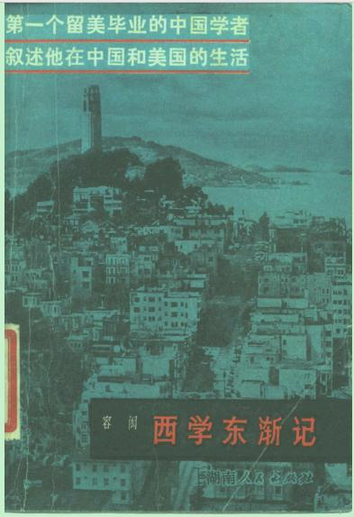

序言，了解了一下当时的历史

《西学东渐记》是容闳用英文写的回忆录，原名《My Life in China & America》读了序言，了解了当时的历史社会情况，后面翻译的文言文实在没法读，不如去看英文

内容简介
本书为容宏晚年用英文撰写的一部自传体回忆录，书中回顾了容氏一生以“西学东渐”之志，寻“维新中国”之路，却屡遭曲折磨难的生命历程，饱含着他对祖国前途和命运的忧心瞩望。作者纵横四海，遭遇众多世界大事，对祖国的忠诚却始终不渝，加之其在西学东渐与维新自强的历史进程中扮演着颇为重要的角色，触目所在，都是中国近代变革的丰富细节，本书堪称中国近代史上的名著。



