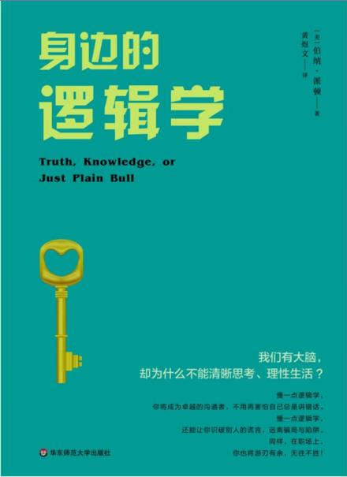

1.用逻辑抵御骗局

2.定义很重要，定义在导出结论时相当重要，就像数学中的推理一样，首先就要定义，而且没有精确的定义就无法使用逻辑，比如同样说民主，苏联人认为他们是民主国家，而美国不是。对苏联人来说，民主是指生产工具共有的无阶级社会，而苏联已经做到了这一点，美国则尚未实现，

3.口号会模糊思考,提防口号，尤其是反复出现的口号，它们通常错得离谱。不断重复的口号是一种激励人心的形式，我们应该反过来想，为什么要激励我们



- > 导论 简单的真理不简单

  - > 一相情愿的思考会让人觉得快乐、温暖、惬意，但如果要在真实世界里付诸实践，就难免会遇到阻碍：轻者给你带来不便，重者则会让你有生命危险。

  - > 教训：因为简单答案不存在，所以简单答案很可能是错的。是的，是错的。因此，不要不假思索地接受任何简单答案，尤其是回答复杂问题的简单答案。

  - > 教训：复杂的问题难以回答。

  - > 因为复杂的问题没有简单答案。

  - > 人们认为可能有简单答案，人们想相信有简单答案，这种观念正是人们一再受骗的原因。人们陷入圈套，不是没抓到重点，就是未能做该做的事，或是做出错误或不必要的举动。

  - > 这些诈骗手法之所以成功，是因为绝大多数人都不思考。就算他们能思考，他们思考的方式也不对；就算他们能正确思考，他们也不愿正确思考，因为这么做太费脑筋；而且就算他们能正确思考，他们通常也不按照思考得出的结论来行动。

  - > 这是令人难过的事实，大多数人宁愿沉溺于无知之中。面对复杂问题，
    > 大多数人宁可要一个简单而无负担的答案，大多数人欢迎简单的解决方式，即使他们内心深处知道它很可能是错的。

    > 大多数人宁可要一个简单而无负担的答案，大多数人欢迎简单的解决方式，即使他们内心深处知道它很可能是错的。

  - > 为什么简单答案吸引这么多人犯错？简单答案之所以吸引我们，有这么几个原因：谨慎而迟疑的人，不会给别人留下什么印象；平稳的陈述（statement）与详尽的解释，似乎表示软弱与优柔寡断；大胆而直率的主张（即使是错的），似乎代表了力量与活力。因此，人们重视简单与化约的说法，但却轻视复杂而精细的答案。

  - > 许多人宁愿死，也不愿思考——事实上，他们确实如此。

  - > 持续思考，努力不懈地改善自己的思考。这么做并不容易，尤其是刚开始的时候，但你要坚持下去。经过一段时
    > 间后，你会发现思考是件有趣的事；你将会掌握个中诀窍，正如你掌握开车或使用刀叉的诀窍那样；你将乐在其中，特别是它带给你的自由，正如你从开车所经历到的乐趣与自由，从使用刀叉吃饭所感受到的便利那样；你将跟我一样，有能力反驳人们所说的一切，并兴致盎然地指出他们视为圣牛的观念不过是堆垃圾。

    > 间后，你会发现思考是件有趣的事；你将会掌握个中诀窍，正如你掌握开车或使用刀叉的诀窍那样；你将乐在其中，特别是它带给你的自由，正如你从开车所经历到的乐趣与自由，从使用刀叉吃饭所感受到的便利那样；你将跟我一样，有能力反驳人们所说的一切，并兴致盎然地指出他们视为圣牛的观念不过是堆垃圾。

  - > 当心电视与大众媒体最后要提出一个警告：当心电视与大众媒体。它们是你的敌人，是清晰思考的敌人，通常也是任何思考的敌人。

  - > 原则：电视与大众媒体容易让人变笨。

  - > 不管是老师、广告商、大企业家或政客，这些想要影响你的人，往往会根据听众的智力高低，调整他们的说话内容，而听众数量越多，智力就越低。这就是为什么新闻必须切割成一连串摘要，简化成最简单的元素，然后再将它们编成新闻标题与口号，设计成轻薄短小、容易理解的信息——而且通常是错误的信息。

  - > 托马斯·杰斐逊曾说，比起读报纸的人，不读报纸的人知道的东西更多，因为他们的脑子里不会塞满错误信息。

  - > 媒体之所以欺骗我们，通常是因为它们自欺，有时则是因为它们想将自己的产品——也就是新闻——贩卖给我们。

  - > 你看到多少“末日恐惧”？人类灭亡的最新原因是什么？你是不是经常听到这类说法？全球变暖，还是全球变冷？艾滋病？臭氧层空洞？千禧危机？帮派犯罪与毒品泛滥？白宫性丑闻？这些日常生活中经常出现的忧虑是否真的重要？可叹的是，在这个重视吸引他人眼球的时代里，思考成为一种失传的技艺，而人们的灵魂受苦之时，注意力也随之萎缩。

- > 第一章 过度概括

  - > 马克·吐温曾说：“真正造成伤害的，不是我不知道的事，而是所有我已知的事都是不真实的。”你不知道的事可能会对你造成伤害。不过，你以为自己了解但实际上却是错误的观念，造成的伤害更大。

  - > 知名电影明星使用力士香皂，顶多只能说明有人付钱请她代言。而明星拿的报酬越多，她的代言就越可能带有偏见，而我们也越不应该相信此广告。

  - > 教训：广告代言毫无意义，不应相信或遵从。

  - > 广告商精通不理性思考的技巧。几乎没有广告商诉诸理性；绝大多数宁可采取断言、反复重述与捆绑联结，这些都是非理性的过度概括。

- > 第二章 模糊定义

  - > 正确的定义能带领我们走向真理，模糊的定义则带领我们走向错误。读完本章之后，你应该能了解如何运用其中的几种定义，如类定义、分割定义、特定标准定义或举例定义，并且挖掘出人们话中隐藏的意义。

  - > 有些定义受到文化限制，并且因地而异。索马里人对“贫穷”的定义完全不同于美国人。事实上，美国官方定义为“贫穷”的收入水平，与索马里认为相当富有的收入水平相差无几。

  - > 重点不在于争论什么是火器，什么不是火器；不在于讨论什么是人，什么不是人；也不在于告诉你西红柿是水果、蔬菜还是浆果；重点不在于告诉你“贫穷”这个词在索马里所指的贫困水平不同于美国，也不在于舍弃鲸鱼目前的生物学分类。真正的重点是清楚证明定义在导出结论时的重要性。有人甚至认为，一旦接受某些定义，则几乎可自然而然地导出某些结论。所以要小心，确定自己知道自己在说什么，确定自己知道别人在说什么。

  - > 冷战期间，苏联与美国针对哪国政府才是真民主展开了一系列辩论。苏联人认为他们是民主国家，而美国不是。对苏联人来说，民主是指生产工具共有的无阶级社会，而苏联已经做到了这一点，美国则尚未实现。由于使用不同的定义，苏联与美国互控对方不民主。争论的重点在于我们应该使用哪种民主的定义。若使用美国的定义，则美国是民主国家；若使用苏联的定义，则苏联是民主国家。

  - > 原则：每个陈述都有两个意义——公开意义与隐含意义。几乎你听到的每个陈述都至少有两个意义，就是明显意义与隐藏意义，这两种意义又称为“公开意义”与“隐含意义”。公开意义只要从陈述的字面加以诠释便能理解；隐含意义并不明显，也不容易理解，通常必须更深一层地挖掘公开陈述的隐藏意义。

  - > 看看下面这句陈述：“当我走进办公室，所有人都会坐直身子，把脚从桌上放下来，并停止看报。不过，你是我的员工当中最有效率的，所以你虽然没这么做，但我不会放在心上。”我们先停下来思考一下。公开信息是什么？隐含的信息是什么？你看出多少隐含意义？老板喜欢的员工行为是什么？不喜欢的又是什么？老板真的不在乎员工的行为吗？答案是：如果老板真的不放在心上，那何必提出来？隐含信息与公开信息相互矛盾，而且隐含信息还特地以分割定义的方式，将老板不喜欢的行为一一列出。实际上，老板希望自己进办公室时会看到员工坐直身子；他希望员工不要把脚抬到桌子上；他希望员工不要只在他出现时停止看报纸，甚至是不要在上班时间看报纸。如果老板不在乎他所列举的行为，那么他又何必详细地一件件提出来？此外，老板也送出了一个隐含的信息，如果效率降低，那员工的麻烦就大了，因为唯有效率，才能让他将功赎罪。问题：如果员工听出老板话里的隐含意义，你想，员工能得到什么好处？好的，你想出答案了吗？有些好处一眼就可看出，不是吗？当我们做了符合老板心意的事，我们很可能加薪，老板也很可能会慎重考虑我们提出的各种要求。当我们合乎与超越老板的期望时，我们更有可能获得晋升以及其他能增进我们个人幸福之事。但你是否明白了老板话里真正的隐含信息？我认为，真正的信息只有两个：“尊敬我”与“维持效率”。为了应付这种老板，我会试着迎合这两件事，特别是尊敬，因为这是他要的。有时耍弄一点逢迎拍马的技巧，也能满足老板的自我需要。无论如何，这都值得一试。而我说“值得一试”的意思是“如果你有勇气一试的话”。另一方面，看出隐含信息之后，你可以决定不再为这样一个凡事斤斤计
    > 较的老板做事。你可能认为，这样一个以自我为中心的老板，他的领导风格不合你的胃口。你可以趁早离开，找另一个符合你需要的公司。不管怎样，看出隐含意义，可以让你在竞争中抢得先机，因为你比别人更了解真相，也就是现实处境；因为你更了解真相，你便能更早地采取明智行动。

    > 较的老板做事。你可能认为，这样一个以自我为中心的老板，他的领导风格不合你的胃口。你可以趁早离开，找另一个符合你需要的公司。不管怎样，看出隐含意义，可以让你在竞争中抢得先机，因为你比别人更了解真相，也就是现实处境；因为你更了解真相，你便能更早地采取明智行动。

- > 第三章 在此之后，因此之故

  - > 医生与政治人物发现“在此之后”的谬误可为他们的名声增色不少。医生作出诊断，开出药方，然后病人的症状消失。吃药，然后痊愈，光这个事实并不能证明什么，只能说明一件事情接在另一件事情后面发生。药物可能毫无疗效，痊愈凭借的纯粹是自然的力量。

  - > 绝大多数疾病都能自行痊愈，若非如此，人类不可能生存至今。历史告诉我们，有许多病例，医药的治疗不仅无效，反而有害。

- > 第四章 错误类比

  - > 原则：口号会模糊思考。

  - > 教训：提防口号，尤其是反复出现的口号，它们通常错得离谱。不断重复的口号，意味着它的反面比较接近真理。不断重复的口号是一种激励人心的形式，我们应该反过来想，为什么要激励我们。

  - > 说明希特勒如何想到要成立宣传部（之后扩大为国民教育与宣传部）。希特勒任命戈培尔为国民教育与宣传部部长，并且命令他设计口号，
    > 即使愚蠢而不真实，但只要不断重复，人们终究会信以为真。

    > 即使愚蠢而不真实，但只要不断重复，人们终究会信以为真。

  - > 所有的电台与报纸都在戈培尔的掌握之下。要在第三帝国统治下当个编辑，首先必须在政治与种族上是“纯净的”。根据1933年10月4日颁布的法律，新闻事业是“公共性的职业”，国家必须管制，而编辑必须是德国公民，具有雅利安人血统，且未与犹太人结婚。于是，德国新闻界自然成为一言堂，每天的新闻都是弥天大谎。少数几个精于言词煽动、操纵群众与欺骗的领导人，带领整个国家走向悲惨的境地。

- > 第五章 片面拣选证据

  - > 当情感强过理性时妄想是一种错误信念。一种最值得注意的妄想，是人类生来就是完全理性的。许多证据指出，在人类构思事物时，情感的角色比理性还重要。

  - > 主题公园的目标，是满足民众膨胀的自我需求，而不是教导任何人做任何事。当然，我反对说：“这不是真的。”L先生向我保证这是真的，并引用数据佐证他的陈述，能呈现了无新意的场景的主题公园，往往相当赚钱，至于呈现真实信息的则是惨赔。因此，我的主题公园若要成功，就必须简化原有的复杂内容，诉诸情感与偏见，片面拣选历史证据与给予错误的历史图像，这样才能迎合游客的思想习惯。他向我保证，主题公园的现实情况就是如此，数百万人所观看的场景，全都是用来激励歪曲的思考。

  - > 原则：民众想看到自己想看的设施与场景。以此导出：教训：当你听到有人提到主题公园或电视节目，并且认为它们是信息来源时，唯一合理的响应方式是迎合他们。

- > 第六章 集体思维

- > 第七章 诈骗

  - > 原则：所有诈骗都可以分为6个部分。牢记诈骗的6个部分，如此当有人试图骗你时，你就能分辨出并加以反制。

- > 第八章 回避问题

- > 第九章 读我

- > 第十章 爱丽丝的逻辑

