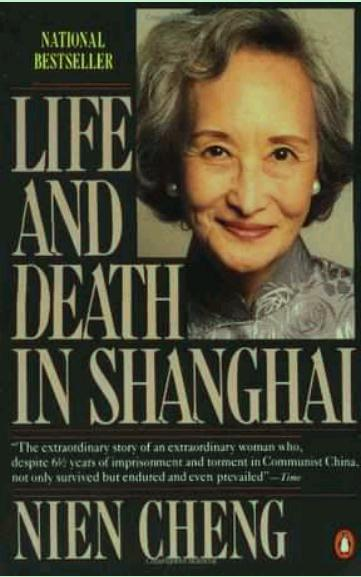

内容简介
这是一部纪实小说。本书主人公，曾是国民党一名高级外交官的妻子。上海解
放前夕，携独生女儿自海外归来。解放后任英国亚细亚石油公司上海分公司经
理（这是解放后唯一留在大陆上的西方石油公司）。十年浩劫打破了她宁静、
舒适的生活，她被批斗、抄家，并被投入监狱。更使她悲痛钬绝的是，她所钟
爱的当电影演员的独生女儿被活活打死……这是一个发生在那个疯狂的年代的惨
绝人寰的真实故事。   它自始至终紧紧抓住读者的心，令读者随书中主人公
而哭泣、而绝望、而愤慨！本书作者时。十午文革的独特的思考，也值得引起
人们的深思


<!-- more -->

## 

- > 我们深信共产主义是中国历史发展的必然趋势，我们愿跟随历史车轮共同迈步。

- > "毛主席讲过，每个中国人，都要参加文化大革命。"戚说

- > 每位职工都为能从外资公司服务的不平等地位中解放出来后韵光明前途，而感到欢欣。他们都愿当国家机关的职工，为社会主义作出贡献

- > 社会主义的敌人是非常狡猾的。有些人打着红旗反红旗，有些人笑中藏刀。他们勾结国外帝国主义和国内资产阶级，反对社会主义，妄想让中国人再吃二遍苦，受二茬罪。你们能允许他们成功吗？不！当然不答应，一百个不答应！

